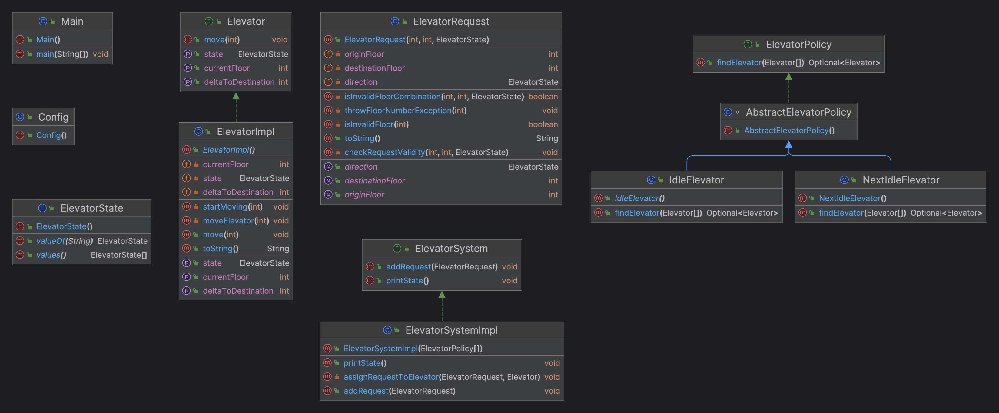

# DC Tower Elevator Challenge

## Assignment Requirements
- Design and implement an elevator control system
- Elevators move to and from ground floor to any floor
- Only the 'pool' of elevators can be called, not a specific one
- Requests are queued and serviced in order of arrival
- A request comes in the form of (current floor, destination floor, direction)

## Implementation Notes
- Configuration (number of elevators etc.) is done via [Config.java](src/main/java/org/example/config/Config.java).
- Policies for elevator selection are implemented in [the policy folder](src/main/java/org/example/domain/policy). The implement and inherit from respective interfaces and abstract classes, and are easily extensible. The order of the policies in the list determines the order in which they are applied.
- Elevator, ElevatorRequest and ElevatorSystem are distinct classes (partly) implementing respective interfaces.
- Unit tests are implemented in [the test folder](src/test/java/org/example/domain). They are not exhaustive, but mostly for demonstration purposes.
- The [Main class](src/main/java/org/example/Main.java) runs a simple, endless simulation of the elevator system.

## Possible Improvements
The following improvements could be made, as the time and scope of this project did not allow for them:
- Test coverage, incl. edge cases and concurrency.
- More sophisticated policies, e.g. based on distance to destination, or based on the number of requests in the queue.
- The alternative logic for the elevator movement with in-between stops (e.g. not only 3 -> 14, 14 -> 0, etc., but also 3 -> 7 -> 14, 14 -> 7 -> 0, etc.) could be implemented by simply interrupting the current movement (i.e. the thread in which the elevator is running), and restarting it with the new destination. This would not require changes in the Elevator class, but only in the ElevatorSystem class, and adding a new policy.

## UML Class Diagram
(Generated with IntelliJ IDEA)

# Requirements and Setup

## Requirements
- Java 20
- Build tool: Maven
- Dependencies: JUnit 5, Lombok, JUnit Params

## Setup and Run
Run 'mvn clean install' to build the project and run the tests. To run the simulation, run the Main class via your IDE of choice or via 'mvn exec:java -Dexec.mainClass="org.example.Main"'.

